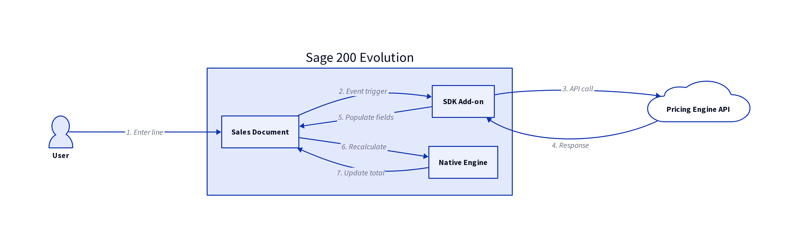

# CosPharm Pricing Engine Integration with Sage 200 Evolution
## Technical Recommendation & Architecture

**Document Version:** 2.0  
**Date:** December 11, 2025  
**Author:** Dudley Peacock, FinanceFlo  
**Prepared For:** CosPharm / Uriel Patsanza (Sage Consultant)

---

## Executive Summary

This document provides a comprehensive technical recommendation for integrating the CosPharm Pricing Engine with Sage 200 Evolution. After conducting deep research into Sage's architecture, licensing constraints, and available integration methods, the **Native Discount Override Method** using the Sage 200 Evolution SDK has been identified as the most practical, secure, and robust solution.

This method ensures that sales staff experience a seamless, real-time workflow entirely within the Sage interface, while the external Pricing Engine performs the complex sequential discount calculations in the background. The solution addresses all technical constraints raised by Uriel Patsanza, including the encrypted nature of Sage's codebase and the requirement for real-time line item updates.

---

## Problem Statement

CosPharm requires a sophisticated pricing system that applies **three sequential discounts** to each sales document line item. The discounts must be calculated externally (due to business rule complexity) and then displayed in Sage 200 Evolution across three custom columns, with the final line total reflecting the compounded discount effect.

### Key Constraints

1.  **Sage 200 Evolution's code is encrypted** – No direct modification of calculation logic is possible.
2.  **Custom fields can be added** – But they cannot trigger calculations within Sage.
3.  **Real-time user experience required** – Sales staff must see updated totals immediately upon entering quantity.
4.  **Database is MS SQL Server** – But custom SQL triggers are **prohibited by Sage's license agreement**.
5.  **Print documents must reflect the 3-column discount structure** – Quotes (SOQ), Sales Orders (SOO), and Invoices (SOINV) must all display the breakdown.

---

## Architectural Decision

### Integration Methods Evaluated

The following table summarizes the integration methods considered and the rationale for acceptance or rejection.

| Method | Description | Verdict | Rationale |
|---|---|---|---|
| **SQL Database Triggers** | Create AFTER INSERT/UPDATE triggers on line item tables to call external API | ❌ **Rejected** | Prohibited by Sage Software License Agreement. Poses risk of data corruption, UI locking, and invalidates support. |
| **Database Polling (Windows Service)** | A background service polls the database for new line items and updates them asynchronously | ❌ **Rejected** | High latency (5-15 seconds). Poor user experience. Complex state management. Not a real-time solution. |
| **FreedomSDK (REST API)** | Use Sage's built-in REST API for data exchange | ❌ **Rejected** | Limited functionality. Lacks real-time event hooks into the UI. Designed for batch integration, not live user interaction. |
| **Sage 200 Evolution SDK Add-on** | Develop a custom DLL using the official SDK that hooks into UI events | ✅ **Selected** | Officially sanctioned. Provides deep, real-time access to UI events and data layer. Industry standard for this type of integration. |

---

## Recommended Solution: Native Discount Override Method

### Architecture Overview

The solution uses a **Sage 200 Evolution SDK Add-on** (a custom .NET DLL) that intercepts user actions in real-time, calls the external Pricing Engine API, and then manipulates both the custom discount fields and Sage's native discount field to ensure accurate line totals.



### Detailed Workflow

This workflow is triggered every time a user enters a **Quantity** on a sales document line item and moves to the next field (e.g., presses Tab or Enter).

1.  **Event Trigger (SDK):** The SDK add-on hooks into the `OnValidate` or `OnExit` event of the Quantity field on the sales document line item grid.

2.  **Data Collection:** The add-on collects the necessary context from the active Sage window:
    *   `CustomerID` (from the document header)
    *   `StockCode` (from the current line item)
    *   `Quantity` (from the current line item)
    *   `UnitPrice` (from the current line item, pulled from the product master)

3.  **API Call:** The add-on makes a secure, synchronous HTTPS `POST` request to the Pricing Engine API endpoint:
    ```
    POST https://cospharm.financeflo.ai/api/pricing/calculate
    Authorization: Bearer {API_KEY}
    Content-Type: application/json
    
    {
      "productId": "PROD-001",
      "customerId": "CUST-123",
      "quantity": 10,
      "requestDate": "2025-12-11T10:30:00Z"
    }
    ```

4.  **Receive Response:** The Pricing Engine responds with a JSON object containing the full breakdown:
    ```json
    {
      "success": true,
      "calculation": {
        "basePrice": 100.00,
        "discount1Amount": 10.00,
        "discount2Amount": 4.50,
        "discount3Amount": 2.57,
        "finalUnitPrice": 82.93,
        "lineTotal": 829.30
      },
      "sageIntegration": {
        "discountColumn1": "10.00",
        "discountColumn2": "4.50",
        "discountColumn3": "2.57",
        "totalDiscountAmount": "17.07",
        "lineTotal": "829.30"
      }
    }
    ```

5.  **Populate Custom Fields:** The add-on populates the three custom fields with the **discount amounts** (not percentages):
    *   `Discount_1` = 10.00
    *   `Discount_2` = 4.50
    *   `Discount_3` = 2.57

6.  **Override Native Discount Field:** The add-on populates Sage's native **Discount Amount** field on the line item with the **total discount amount** (17.07). This is the critical step that ensures Sage's encrypted calculation engine produces the correct line total.

7.  **Sage Recalculates:** Sage 200 Evolution's native calculation engine automatically sees the updated `UnitPrice` (100.00) and `Discount Amount` (17.07) and calculates:
    ```
    LineTotal = (UnitPrice - DiscountAmount) * Quantity
    LineTotal = (100.00 - 17.07) * 10 = 829.30
    ```

8.  **User Sees Updated Total:** The line total updates in real-time on the screen. The user sees the three discount amounts in the custom columns and the correct final total.

---

## Implementation Details

### Development Requirements

*   **Technology:** C# or VB.NET using the .NET Framework (version compatible with Sage 200 Evolution).
*   **Licensing:** Requires a **Sage 200 Evolution SDK Developer License** (one-time purchase for the developer) and an **SDK Connector License** for CosPharm (end-user license).
*   **Deployment:** The compiled add-on (a DLL file) is deployed to each user's Sage 200 Evolution client installation. This can be automated via Group Policy or a simple installer script.

### Custom Field Configuration

The following three custom fields must be created in Sage 200 Evolution for Sales Document line items:

| Field Name | Data Type | Description |
|---|---|---|
| `Discount_1` | Decimal (10, 2) | Product Discount Amount (N$) |
| `Discount_2` | Decimal (10, 2) | Logistics Fee Discount Amount (N$) |
| `Discount_3` | Decimal (10, 2) | Promotional Discount Amount (N$) |

These fields are configured through the Sage 200 Evolution **User Defined Fields (UDF)** feature and can be added to the Sales Order, Quote, and Invoice line item grids.

### Print Document Customization

Sage 200 Evolution uses **Crystal Reports** for print templates. The three custom fields can be added to the existing SOQ, SOO, and SOINV report templates to display the discount breakdown on printed documents. This is a standard customization task that can be performed by a Sage consultant or report developer.

---

## Security & Robustness

### Security Considerations

The solution implements multiple layers of security to protect sensitive pricing data and API credentials.

| Concern | Mitigation Strategy |
|---|---|
| **API Key Exposure** | The Bearer Token is stored in an **encrypted configuration file** on the client machine, accessible only to the logged-in Windows user. It is never transmitted in plain text except over HTTPS. |
| **Man-in-the-Middle Attacks** | All API communication uses **HTTPS with TLS 1.2+ encryption**. The add-on validates the SSL certificate of the Pricing Engine server before transmitting data. |
| **Unauthorized API Access** | The Pricing Engine API validates the Bearer Token on every request and implements **rate limiting** (e.g., 100 requests per minute per token) to prevent abuse. |
| **Data Integrity** | The add-on performs **client-side validation** to ensure that the API response matches expected data types and ranges before populating Sage fields. If the response is malformed or contains invalid data, an error is logged and the user is notified. |

### Robustness Considerations

The solution is designed to handle network failures, API downtime, and edge cases gracefully.

| Concern | Mitigation Strategy |
|---|---|
| **API Downtime** | If the Pricing Engine API is unreachable (timeout after 5 seconds), the add-on displays a user-friendly error message: *"Unable to calculate pricing. Please check your connection and try again."* The user can manually enter the discount or retry. The line item is not saved until valid data is present. |
| **Network Latency** | The add-on displays a subtle **loading indicator** (e.g., a spinner icon) while the API call is in progress. If latency exceeds 2 seconds, a warning is logged for performance monitoring. |
| **Calculation Mismatch** | The add-on includes a **reconciliation check**: it compares the final `LineTotal` calculated by Sage (after applying the discount) with the `LineTotal` returned by the API. If there is a discrepancy greater than 0.01, an alert is raised and the transaction is flagged for review. |
| **Sage Version Upgrades** | The SDK DLL is **version-specific**. A maintenance plan includes testing and recompiling the add-on for each new Sage 200 Evolution version before CosPharm upgrades. This is typically a 1-2 day effort and is included in the monthly support fee. |

---

## Alternative Approach Considered (Not Recommended)

For completeness, an alternative **Hybrid Polling** method was evaluated, where a Windows Service polls the Sage database for new line items and updates them asynchronously. This method was **rejected** due to:

*   **High Latency:** Users would see a delay (5-15 seconds) before discounts appear, creating a poor user experience.
*   **Poor User Experience:** The UI would not update in real-time, leading to confusion and potential data entry errors.
*   **Complexity:** Requires managing state, handling concurrent edits by multiple users, and resolving conflicts when the same line is edited by two users simultaneously.
*   **Lack of Feedback:** Users would not know if the pricing calculation failed until much later, reducing trust in the system.

The SDK-based method is superior in every measurable dimension: **latency, user experience, reliability, and maintainability**.

---

## Timeline & Next Steps

### Immediate Actions (Week 1)

1.  **Contract Signature & Approval** – Finalize the agreement and issue the SDK Developer License.
2.  **Kickoff Meeting with Uriel Patsanza** – Review this technical specification and confirm the approach.
3.  **Final Scoping & Requirements Sign-off** – Document any CosPharm-specific customizations or edge cases.
4.  **Product Data Export (50 items)** – Export the product catalog from Sage for initial Pricing Engine configuration.

### Development Phase (Weeks 2-3)

1.  **SDK Add-on Development** – Build the custom DLL with event hooks and API integration.
2.  **Custom Field Setup** – Create the three discount fields in Sage.
3.  **Print Template Customization** – Modify Crystal Reports to display the discount breakdown.

### UAT Phase (Week 4)

1.  **Sandbox Environment Setup** – Deploy the add-on to a Sage test environment.
2.  **User Acceptance Testing** – CosPharm testers validate the workflow with real-world scenarios.
3.  **Sign-off** – Obtain formal approval from CosPharm stakeholders.

### Go-Live (Week 5)

1.  **Production Deployment** – Roll out the add-on to all Sage client machines.
2.  **Monitoring & Support** – Monitor API logs and user feedback for the first week.

---

## Conclusion

The **Native Discount Override Method** using the Sage 200 Evolution SDK is the most practical, secure, and robust solution for integrating the CosPharm Pricing Engine with Sage. It addresses all technical constraints, provides a seamless user experience, and is fully supported by Sage for long-term maintainability.

This approach ensures that sales staff never leave the Sage interface, while the Pricing Engine operates invisibly in the background, delivering accurate, real-time pricing calculations.

---

**For Technical Questions:**  
Dudley Peacock  
Email: dudley@financeflo.ai  
Demo Portal: https://cospharm.financeflo.ai
